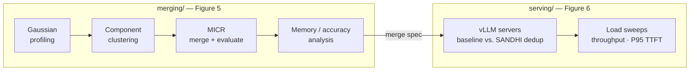

<h1 align="center">SANDHI</h1>

<p align="center"><em>Fine-grained model merging for memory-efficient multi-model LLM serving</em></p>

<p align="center">
  <a href="#citation"></a>
  <a href="https://doi.org/10.5281/zenodo.22108093"></a>
  <a href="LICENSE"></a>
  <a href="#getting-started"></a>
</p>

<p align="center">
  Artifact for <strong>SANDHI: Fine-Grained Merging for Memory Efficient
  Multi-Model Serving</strong> (SOSP '26) —
  <a href="merging/README.md">merging pipeline</a> ·
  <a href="serving/README.md">serving harness</a> ·
  <a href="serving/results/README.md">recorded results</a>
</p>

SANDHI is a system that adaptively merges models, at a component granularity,
while adhering to the user's accuracy requirements: it serves a pool of
fine-tuned LLMs in less GPU memory by selectively merging per-layer
attention/MLP projections across models and deduplicating the merged tensors
at serving time. Our evaluation on 12 models spanning 3 model families across
9 different benchmarks shows that SANDHI reduces GPU memory footprint by up
to 49.8%, which translates to improvements of up to 2.93× in throughput and
2× lower cost.

**Contents** — [Key results](#key-results) · [Overview](#overview) ·
[Requirements](#requirements) · [Getting started](#getting-started) ·
[Reproducing the results](#reproducing-the-results) · [Scope](#scope) ·
[Experimental setup](#experimental-setup) · [Dependencies](#dependencies) ·
[Citation](#citation) · [License](#license)

## Key results

Best-rate improvement of SANDHI over independent serving, from the recorded
reference runs shipped in [`serving/results/`](serving/results/README.md)
(per-rate sweeps, server logs, and plots there):

| deployment scenario | benched family | throughput | P95 TTFT |
|---|---|---|---|
| 2× DeepSeek-7B (A100-40GB budget) | DeepSeek | **1.97×** | up to **43×** |
| 5× Llama-3.1-8B (80 GB budget) | Llama | **7.1×** | up to **2534×** |
| 7 models, Llama + Qwen (2× 80 GB) | Llama / Qwen | **3.4× / 2.5×** | **1329× / 443×** |
| 9 models, 3 families (2× H200) | DeepSeek / Llama / Qwen | **2.94× / 2.14× / 1.69×** | **1011× / 640× / 294×** |

The per-pool memory savings behind these runs, and the measured accuracy at
each operating point, are documented in [`merging/README.md`](merging/README.md).

## Overview

The artifact has two halves, connected by the merge specs the first emits and
the second serves:



| directory | what it holds |
|---|---|
| [`merging/`](merging/) | gaussian profiling → component clustering → MICR merge-and-evaluate → memory/accuracy analysis (Figure 5, per-pool merge specs) |
| [`serving/`](serving/) | load benchmarks per deployment pool, baseline vs SANDHI mode; throughput and P95 TTFT (Figure 6) |

The merging pipeline emits a merge spec (`analysis/<set>/C.json`); the serving
harness consumes it (`SHARED_SPEC`, prebuilt copies in `serving/specs/`).
See [`merging/README.md`](merging/README.md) and
[`serving/README.md`](serving/README.md).

Both parts run in prebuilt Docker images:

| part | image |
|---|---|
| merging | `oytunkuday/merge-tools:reference` |
| serving | `nandanmeda1999/sandhi-inference:latest` |

## Requirements

- **GPUs** — NVIDIA GPUs with the NVIDIA container runtime. We use NVIDIA
  H200 GPUs (141 GB HBM) unless stated otherwise, on AMD EPYC machines
  connected via NVLink where applicable, running Ubuntu 22.04 with CUDA 12.6.
  Tensor-parallel degree is set per experiment according to the compute and
  memory requirements of multi-model serving.
- **Software** — Docker only; both pipelines run in the prebuilt images
  above (pinned by digest in `merging/README.md` and `serving/README.md`),
  so no environment needs to be built. See [Dependencies](#dependencies).

## Getting started

Pull the images and tag them with the short names used throughout:

```bash
docker pull oytunkuday/merge-tools:reference
docker tag  oytunkuday/merge-tools:reference merge-tools:reference
docker pull nandanmeda1999/sandhi-inference:latest
docker tag  nandanmeda1999/sandhi-inference:latest sandhi:latest
```

Then sanity-check the merging pipeline — a dry run, followed by the recorded
7-Llama memory check (expected ~34.5% savings). Both checks finish in
seconds; the image pulls dominate the wall clock:

```bash
CODE=$PWD/merging
docker run --rm --gpus all --shm-size=32g --ulimit nofile=524288:524288 \
  --user "$(id -u):$(id -g)" -e USER="$(id -un)" -e HOME=/tmp \
  -v $CODE:/workspace/merge_tools -w /workspace/merge_tools \
  merge-tools:reference \
  python scripts/run_figures.py --run-name smoke --sets 5b \
    --stages clustering --dry-run --gpus 0

docker run --rm --user "$(id -u):$(id -g)" -e HOME=/tmp \
  -v $CODE:/workspace/merge_tools -w /workspace/merge_tools \
  merge-tools:reference \
  python scripts/build_operating_points.py --pool 7_llamas --validate
```

## Reproducing the results

| figure | claim | pipeline | recorded reference |
|---|---|---|---|
| Figure 5 | per-pool memory savings under an accuracy budget | [`merging/`](merging/README.md) — `run_figures.py` | [`merging/results/`](merging/results/) |
| Figure 6 | throughput and P95 TTFT, baseline vs SANDHI, five deployment scenarios | [`serving/`](serving/README.md) — `run_all.sh` | [`serving/results/`](serving/results/README.md) |

### Figure 5 (merging)

One command per figure set; runbook in
[`merging/REPRODUCE_DOCKER.md`](merging/REPRODUCE_DOCKER.md):

```bash
# inside the merging container (dock() wrapper from the runbook)
python scripts/run_figures.py --run-name r1 --sets 5b --gpus auto
```

Sets: `5a`–`5d` and `6a`–`6f`. Results land in
`merging/runs/<run>/analysis/<set>/` (`report.csv`, `pareto.png`, operating
points). Baselines: `merging/BASELINES.md`.

### Figure 6 (serving)

One command per deployment scenario; full details in
[`serving/README.md`](serving/README.md):

```bash
# start the serving container (1 GPU for single-pool scenarios, 2 for cross-family)
docker run --rm -it --runtime nvidia --name sandhi_eval --gpus '"device=0,1"' \
    --ipc=host -p 8000:8000 -v /path/to/hf_cache:/root/.cache/huggingface \
    --entrypoint /bin/bash sandhi:latest

# from the host: copy in the harness and the merge specs
docker cp serving/sandhi_scripts/ sandhi_eval:/vllm-workspace/
docker cp serving/specs/. sandhi_eval:/vllm-workspace/sandhi_scripts/

# inside the container: one command per scenario
cd /vllm-workspace/sandhi_scripts
bash run_all.sh --config llama5_config.sh       --run-base-dir /vllm-workspace/llama5_out
bash run_all.sh --config ds2_40gb_config.sh     --run-base-dir /vllm-workspace/ds2_out
bash run_all.sh --config llama-qwen_config.sh   --run-base-dir /vllm-workspace/llama_qwen_out
bash run_all.sh --config llama-qwen-ds_config.sh --run-base-dir /vllm-workspace/llama_qwen_ds_out

# render the paper-style panels from any results directory (host; pandas+matplotlib)
cd serving/paper_plots
python parse_bench_logs.py --results-root ../results   # or your run's results dir
python performance_plots.py                            # -> figures/*.pdf
```

These commands are self-contained: models download automatically, and the
sandhi arm deduplicates the original checkpoints according to the spec — no
merged weights need to be built first. The recorded reference runs in
`serving/results/` (`*_variants`) additionally serve the materialized merged
weights, built with `merging/GENERATE_VARIANTS.md` and enabled via
`MODELS_SANDHI` (see `serving/README.md` § Serving the exact merged weights);
both configurations agree within a few percent.

## Scope

Figures 7–11 and the §5.9 ablations are out of scope for this artifact;
[`serving/offloading/`](serving/offloading/) ships the recorded logs behind
the paper's offloading comparison as supplementary data, outside the
artifact's claims.

## Experimental setup

**Online serving.** We measure throughput and time to first token at steady
state, using representative workloads with varying input and output lengths —
a mean of one thousand tokens per request and a prefill-to-decode ratio of
1:10, reflecting real-world production deployments.

**Metrics.**

| metric | definition | measured with |
|---|---|---|
| Memory savings | percentage reduction in GPU memory footprint relative to the total HBM used across GPUs | merging pipeline's memory model (`merging/`) |
| Accuracy | task-appropriate metric per model | EleutherAI's evaluation harness |
| Throughput | output tokens per second | vLLM's serving benchmark |
| TTFT (P95) | time to first token at the 95th percentile | vLLM's serving benchmark |

Exact versions: the serving image ships the SANDHI vLLM build
`0.11.1.dev14+gf0dd2fcb6` (a fork of vLLM v0.11); the merging environment pins
`vllm==0.11.2` for evaluation.

**Baselines.**

| baseline | description |
|---|---|
| Independent serving | each fine-tuned model loaded separately |
| Multi-SLERP | merges all layers without SANDHI's selective strategy |
| LoRA | adapters applied to the corresponding layers at runtime |

## Dependencies

- **Python packages** — installable with pip. `merging/requirements.txt` is a
  pip-freeze lockfile of the reference environment (Python 3.12; install with
  `pip install --no-deps -r requirements.txt`); `merging/requirements-native.txt`
  is the minimal normally-installable set. The Docker images below ship both
  environments preinstalled, so no manual installation is needed.
- **OS-level dependencies** (CUDA 12.6 stack, vLLM builds, and
  [kvcached](https://github.com/ovg-project/kvcached) v0.1.3 — the elastic
  KV-cache allocator both serving arms run with) are contained in the two
  prebuilt Docker images, pinned by digest in `merging/README.md` and
  `serving/README.md` — pull them as shown there; no image build is needed or
  expected. All recorded reference results in this repository were produced
  with these exact images. Their sources are
  [`ikhyunAn/merge-tools-docker`](https://github.com/ikhyunAn/merge-tools-docker)
  (merging) and the SANDHI vLLM fork
  ([`nandanmeda1999/vllm_merged_model`](https://github.com/nandanmeda1999/vllm_merged_model))
  (serving). Host requirements: Docker with the NVIDIA container runtime and
  NVIDIA GPUs.
- **Exotic dependencies** are downloaded and built automatically:
  model weights and datasets resolve from Hugging Face into a repo-local cache
  on first use; `tinyBenchmarks` installs from its git URL (noted in
  `requirements.txt`); `mergekit` (Figure 5 full-merge baseline only) installs
  with `pip install mergekit` (`merging/BASELINES.md`).
- **Gated dependencies** — every model used by the paper's scenarios is
  ungated. The only gated repo is `meta-llama/Llama-3.1-8B`, needed solely as
  the base for the LoRA baseline: accept the Meta Llama 3.1 license on Hugging
  Face and authenticate with `HF_TOKEN` (`merging/BASELINES.md`). Without
  access, the shipped precomputed LoRA results (`merging/plots/data/lora/`)
  reproduce that baseline's figures.

## Citation

> **SANDHI: Fine-Grained Merging for Memory Efficient Multi-Model Serving**
> Vima Gupta, Oytun Kuday Duran, Nandan Suresh Meda, Ikhyun An (Georgia
> Institute of Technology), Ganesh Ananthanarayanan (Microsoft), and Anand
> Iyer (Georgia Institute of Technology).
> *Proceedings of the 31st ACM Symposium on Operating Systems Principles
> (SOSP '26).*

```bibtex
@inproceedings{gupta2026sandhi,
  author    = {Gupta, Vima and Duran, Oytun Kuday and Meda, Nandan Suresh and
               An, Ikhyun and Ananthanarayanan, Ganesh and Iyer, Anand},
  title     = {{SANDHI}: Fine-Grained Merging for Memory Efficient Multi-Model Serving},
  booktitle = {Proceedings of the 31st ACM Symposium on Operating Systems
               Principles (SOSP '26)},
  year      = {2026}
}
```

## License

MIT (see [LICENSE](LICENSE)). `serving/sandhi_scripts/` is original
MIT-licensed harness code; the SANDHI vLLM fork it drives (Apache-2.0) is
distributed in the prebuilt Docker image — see `serving/README.md`.
